# Relatório Técnico sobre Acesso SSH no EC2

## Introdução

Amazon EC2 é um serviço de computação em nuvem que oferece máquinas virtuais escaláveis, enquanto o SSH é um protocolo de segurança que permite o acesso remoto seguro a sistemas e servidores. Eles são frequentemente utilizados em conjunto, permitindo que os administradores de sistemas acessem e gerenciem suas instâncias EC2 de forma segura através de conexões SSH criptografadas.

## Objetivos

O objetivo desta atividade é criar uma instância EC2 na AWS e acessá-la remotamente por meio do protocolo SSH. O passo a passo será documentado por meio desse relatório, incluindo capturas de tela dos principais momentos do processo.

## Materiais

Acesso à navegadores 
Conta ativa na Amazon Web Services (AWS)
Ambiente de desenvolvimento instalado (Github)
Serviço SSH para a comunicação

## Metódos 

Começaremos entrando na conta da AWS e escolhendo o serviço EC2 para criar a instância.

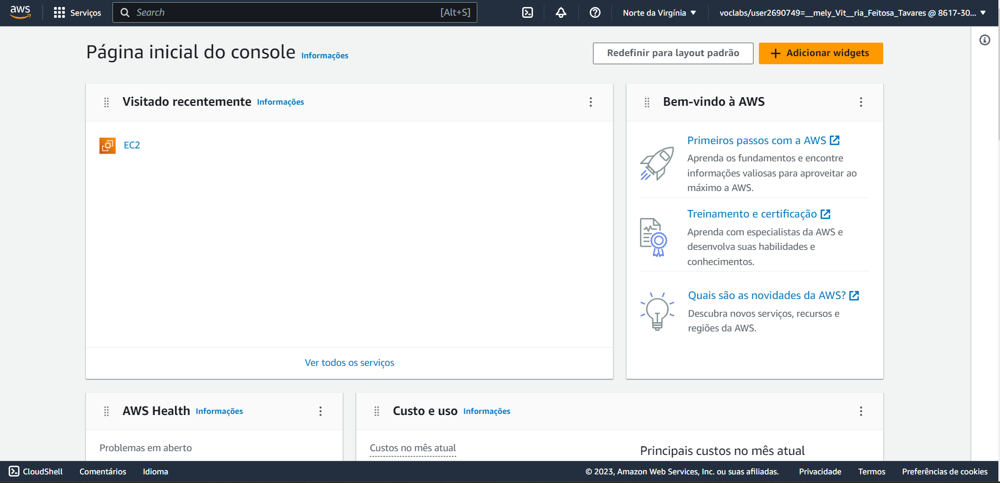

Já na página de recursos, escolhemos a opção "Instâncias" para entrar na página de visualização.

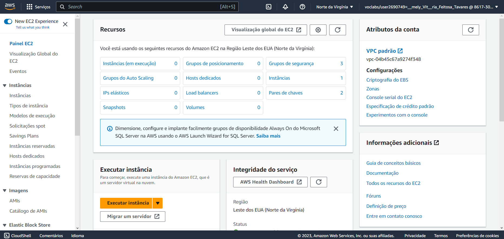

Depois clicamos em "Executar Instâcia", onde seremos direcionados à página de criação.

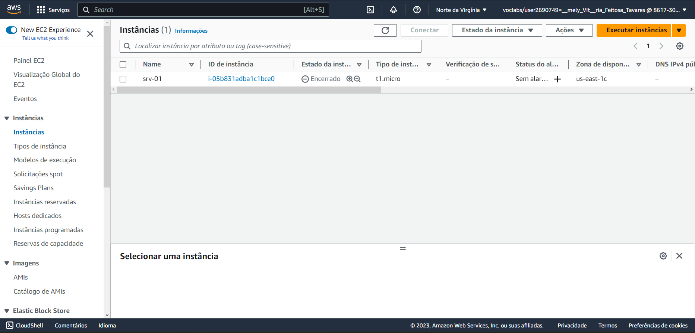

Nessa parte vamos dar nome e escolher a configuração da nossa instância:

Aqui escolhemos uma Amazon Machine Image, usaremos a Amazon Linux.

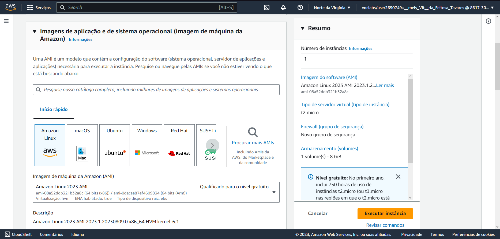

E logo em seguida o tipo instância, vamos optar pela configuração de máquina que melhor atenda as demandas computacionais, para essa tarefa, escolhemos a t1.micro. Cada uma das opções do tipo de instância é otimizada para atender a determinados cenários e requisitos específicos.

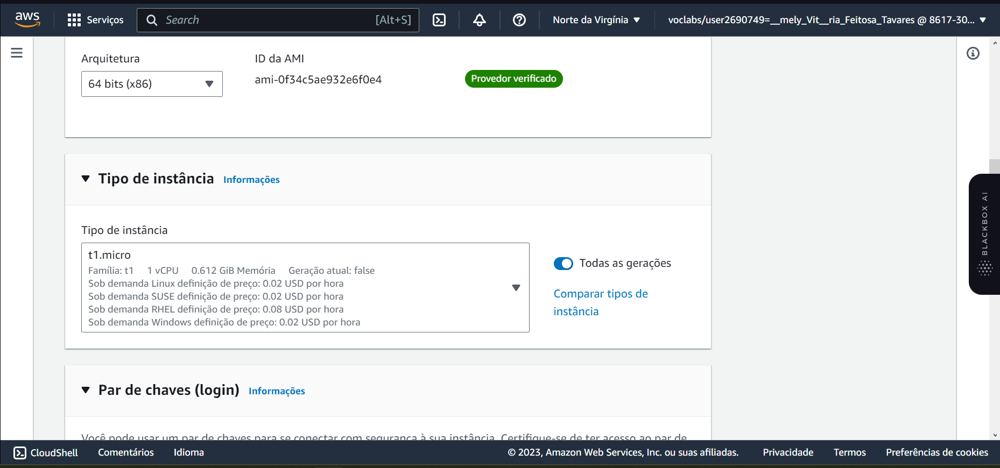

Em seguida, clicamos em "Criar par de chaves", essa etapa serve para que possamos nos conectar a nossa instância com segurança.  O formato de arquivo escolhido foi o .pem pois é compatível com o OpenSSH. 

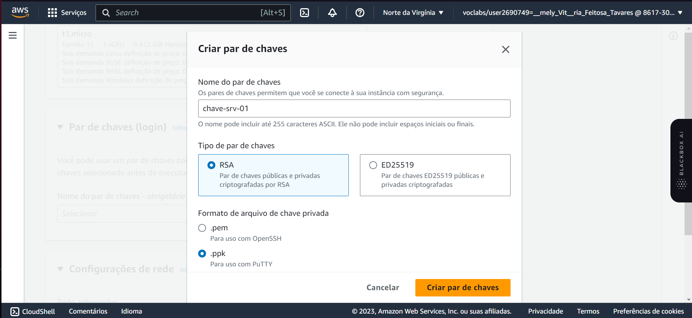

Por fim, deixamos as outras configurações que vem por padrão e clicamos em "Executar Instância".

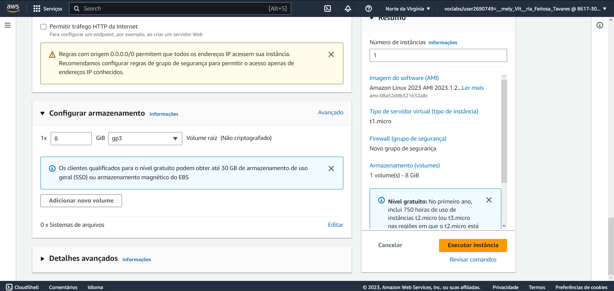

Execução sendo iniciada com sucesso.

Indo para a instância criada podemos ver o resumo das configurações escolhidas, onde podemos editá-las.

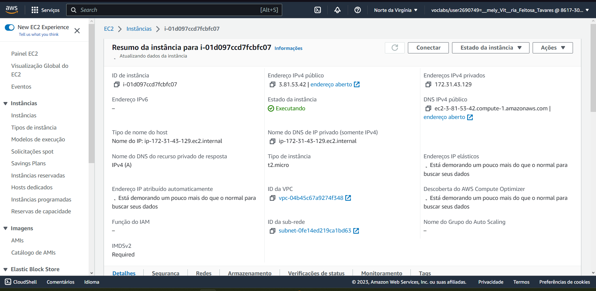

Mais abaixo temos algumas funcionalidades, como: 

- detalhes, que contém as configurações gerais;

- segurança, que contém as regras de firewall;

- rede, que contém as informações gerais de rede;

- armazenamento, que contém as informações sobre os volumes de configuração;

- verificação de status, que contém as informações sobre os status do sistema e de toda a instância;

- monitoramento, que contém info de utilizações;

- e por fim as tags, que contém todas que seram utilizadas no sistema.

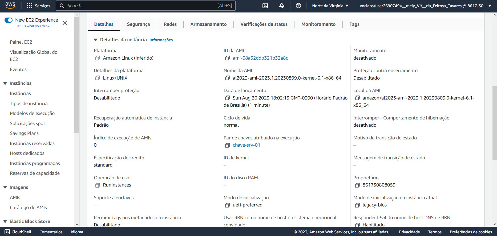

Nessa parte, vamos solicitar a conexão com a instância criada.

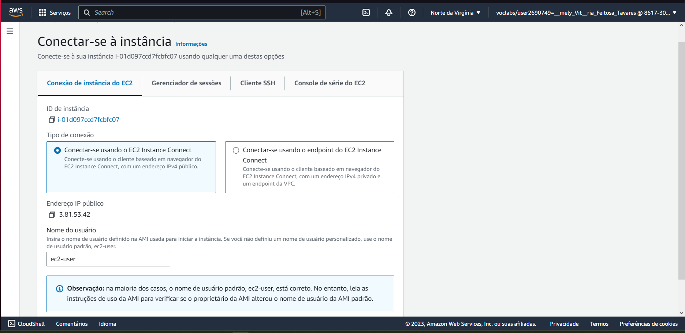

Aqui estamos acessando a maquina pela conexão SSH.

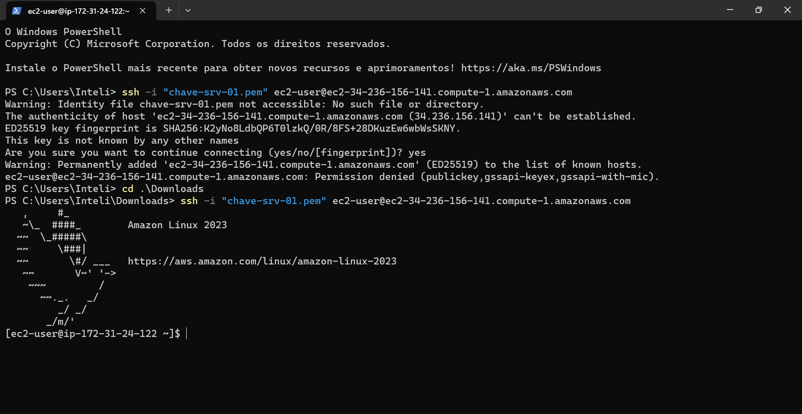

## Resultados

Temos a criação de uma instância de IP 34.236.156.141 como resultado, a qual é possível ser acessada utilizando o protocolo SSH.

## Conclusão

A atividade demonstrou com sucesso o processo de criação de uma instância EC2 na AWS e o acesso subsequente a essa instância usando o protocolo SSH.